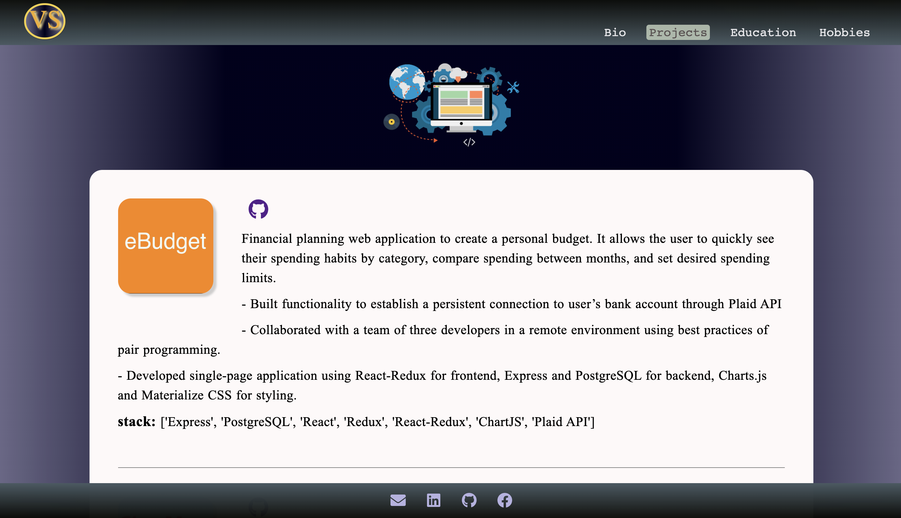

  

<h3 align="center">
  https://vasylsemak.netlify.app/
</h3>

## My personal web application/portfolio.

**Built with using the following technologies:**

- Node.js
- React
- Gatsby
- SASS

  
  
  
  

## Author

<h5>Vasyl Semak</h5>
